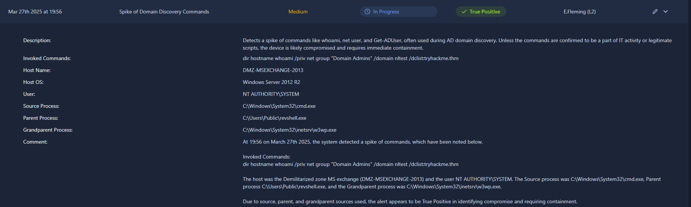

# Spike of Domain Discovery Commands - TryHackMe SOC L1

**Date/Time:** 19:56, 27th March 2025
**Host:** DMZ-MSEXCHANGE-2013
**User:** NT Authority\SYSTEM
**Severity:** Medium
**Verdict:** True Positive

---

## Summary

At 19:56 on March 27th 2025, the system detected a spike of commands, which have been noted below.

**Invoked Commands:**
dir hostname whoami /priv net group "Domain Admins" /domain nltest /dclist:tryhackme.thm

The host was the Demilitarized zone MS exchange (DMZ-MSEXCHANGE-2013) and the user NT AUTHORITY\SYSTEM. The Source process was C:\Windows\System32\cmd.exe, Parent process C:\Users\Public\revshell.exe, and the Grandparent process was C:\Windows\System32\inetsrv\w3wp.exe.

Due to the source, parent, and grandparent sources used, particularly the use of the reverse shell in combination with domain discovery commands, the alert appears to be True Positive in identifying compromise and requiring containment. 

---

## Process Lineage

- **Source:** 'C:\Windows\System32\cmd.exe'
- **Parent:** 'C:\Users\Public\revshell.exe'
- **Grandparent:** 'C:\Windows\System32\inetsrv\w3wp.exe'

This lineage is consistent with a web-server exploitation leading to a reverse shell.

---

## Assessment

The activity is consistent with attacker-driven domain reconnaissance. In particular, the process lineage is consistent with a web-server exploitation and the use of the reverse shell.

---

## L1 Analyst Escalation Notes

- Alert validated as True Positive.
- Domain discovery commands executed under SYSTEM.
- Reverse shell identified as parent process.
- IIS worker process as grandparent indicates web exploitation.
- Escalating to L2 for containment and further investigation.

---

# Screenshot

